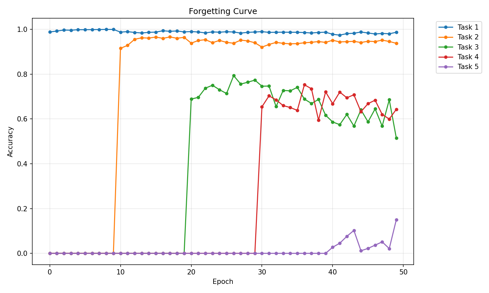
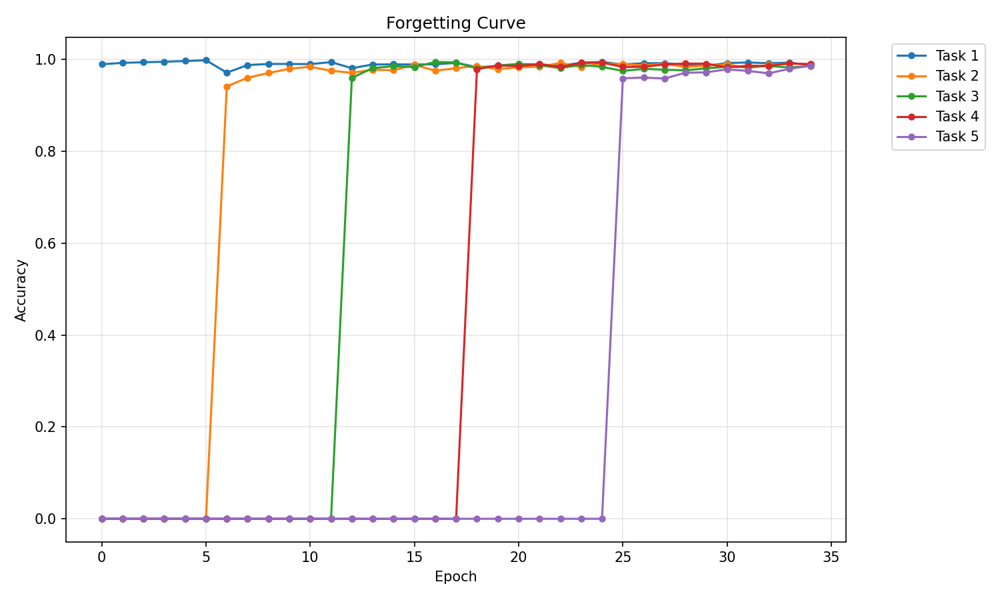
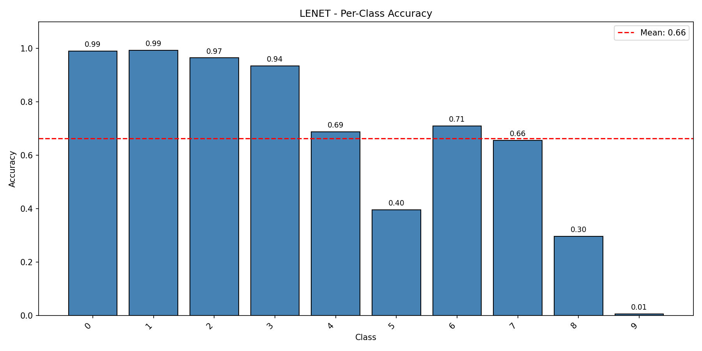
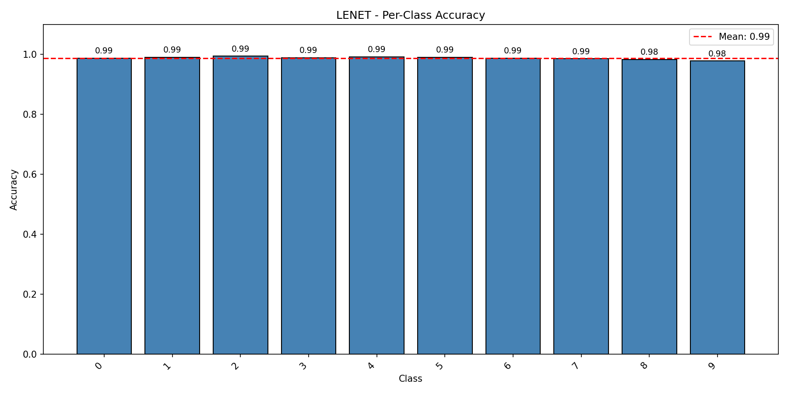
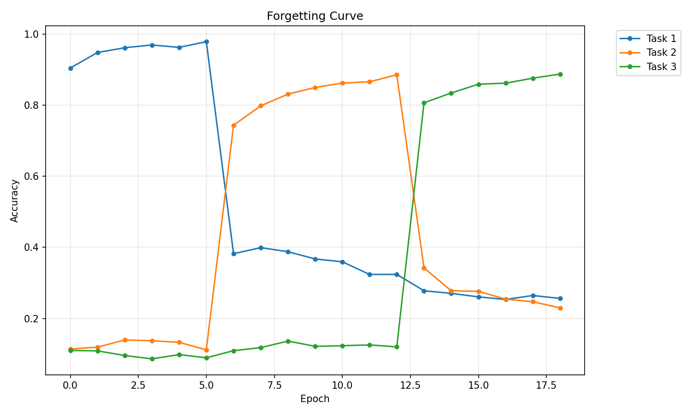
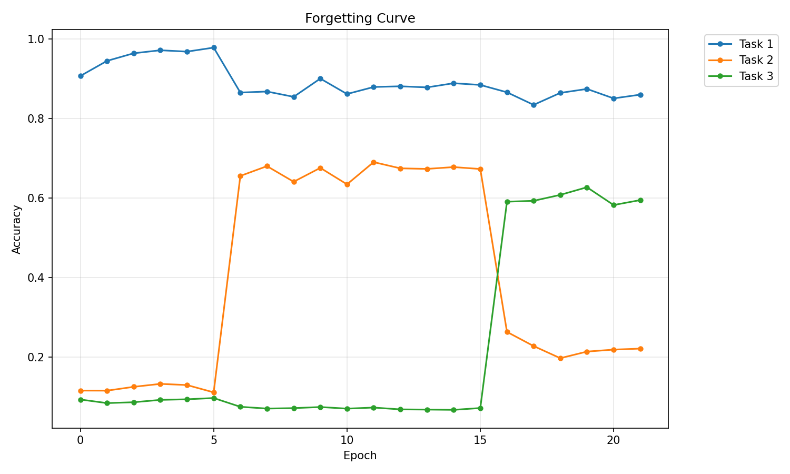
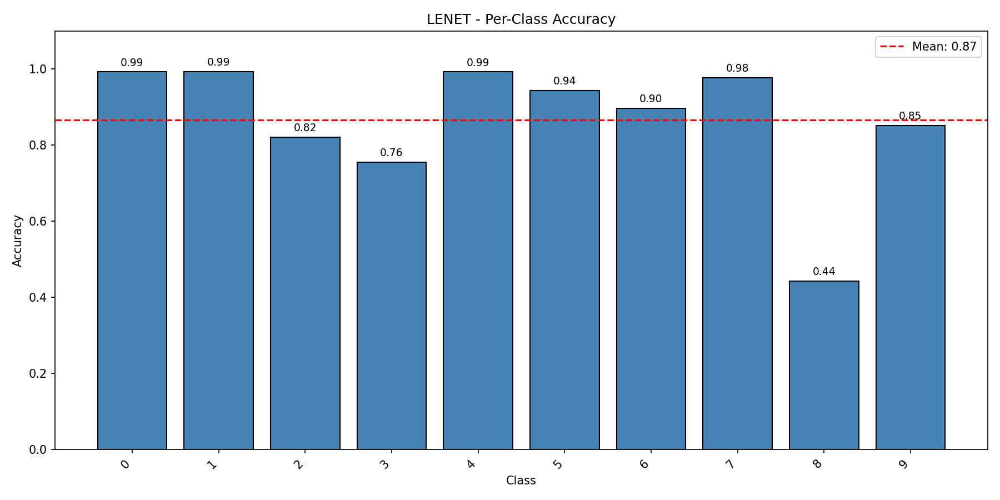

# Elastic Weight Consolidation (EWC) for Continual Learning

Implementation of **Elastic Weight Consolidation (EWC)** and related continual learning algorithms to overcome catastrophic forgetting in neural networks. Based on the paper [*"Overcoming catastrophic forgetting in neural networks"*](https://arxiv.org/abs/1612.00796) by Kirkpatrick et al. (2017).


## Overview

**Catastrophic forgetting** is a major challenge in continual learning where neural networks forget previously learned tasks when trained on new ones. This project implements several techniques to mitigate this problem:

- **EWC (Elastic Weight Consolidation)**: Selectively slows down learning on important weights
- **FIM (Fisher Information Masking)**: Freezes important weights completely
- **IncDet (Incremental Detection)**: Clips large gradients to stabilize training
- **Dropout Regularization**: Prevents overfitting on new tasks
- **Early Stopping**: Terminates training when validation error increases

---

## Catastrophic Forgetting

When a neural network is trained sequentially on multiple tasks, it tends to dramatically forget previous tasks while learning new ones. This phenomenon is called **catastrophic forgetting**.

**Example:** A model trained on digits 0-4, when subsequently trained on digits 5-9, will forget how to recognize 0-4.

<p align="center">
  
  <br>
  <em>Figure: Without EWC, the model forgets Task A when learning Task B</em>
</p>

---

## Methodology

### EWC Loss

The core idea of EWC is to add a regularization term that penalizes changes to important weights. The total loss function becomes:

```
L(θ) = L_B(θ) + (λ/2) Σᵢ Fᵢ(θᵢ - θ*ₐ)²
```

Where:
- `L_B(θ)` = Loss on current task B
- `λ` = Regularization strength (hyperparameter)
- `Fᵢ` = Fisher Information for parameter i
- `θᵢ` = Current parameter value
- `θ*ₐ` = Optimal parameter value from task A

### Fisher Information Matrix

The Fisher Information Matrix (FIM) measures the importance of each parameter:

```
F = E[(∂log P(y|x,θ) / ∂θ)²]
```

For computational efficiency, we use the **diagonal approximation**:

```
Fᵢ ≈ (1/N) Σₙ (∂log P(yₙ|xₙ,θ) / ∂θᵢ)²
```

### Fisher Information Masking (FIM)

FIM is a stricter alternative to EWC that **completely freezes** important weights:

```
∇L' = ∇L ⊙ M
```

Where mask `M` is defined as:
```
Mᵢ = {
    0  if Fᵢ ≥ threshold  (freeze weight)
    1  if Fᵢ < threshold  (allow training)
}
```

---

## Experimental Results

### 1. Dropout + Early Stopping on Incremental MNIST

Comparison of training with and without dropout regularization and early stopping on incremental MNIST (5 tasks with 2 classes each).

#### Training History

<table>
<tr>
<td width="50%">
<p align="center"><strong>Without Dropout & Early Stopping</strong></p>

</td>
<td width="50%">
<p align="center"><strong>With Dropout & Early Stopping</strong></p>

</td>
</tr>
</table>

#### Per-Class Accuracy

<table>
<tr>
<td width="50%">
<p align="center"><strong>Without Dropout & Early Stopping</strong></p>

</td>
<td width="50%">
<p align="center"><strong>With Dropout & Early Stopping</strong></p>

</td>
</tr>
</table>

**Key Observations:**
- Dropout (0.2 input, 0.5 hidden) prevents overfitting on new tasks
- Early stopping (patience=5) reduces unnecessary training time
- Final average accuracy: **66%** (no dropout) vs **99%** (with dropout)

---

### 2. EWC on Permuted MNIST

Comparison of baseline vs EWC on permuted MNIST tasks.

#### Forgetting Curves

<table>
<tr>
<td width="50%">
<p align="center"><strong>Baseline (No EWC)</strong></p>

</td>
<td width="50%">
<p align="center"><strong>With EWC (λ=0.05)</strong></p>

</td>
</tr>
</table>

#### Accuracy Comparison

<table>
<tr>
<td width="50%">
<p align="center"><strong>Baseline (No EWC)</strong></p>

</td>
<td width="50%">
<p align="center"><strong>With EWC (λ=0.05)</strong></p>

</td>
</tr>
</table>

#### Quantitative Results

| Method | Task 1 Final Acc. | Task 2 Final Acc. | Task 3 Final Acc. | Average Forgetting | Final Avg. Acc. |
|--------|-------------------|-------------------|-------------------|--------------------|-----------------|
| **Baseline** | ~27.0% | ~21.0% | ~87.0% | ~67.5% | ~45.0% |
| **EWC (λ=0.05)** | ~86.0% | ~22.0% | ~66.0% | ~30.0% | ~58.0% |

**Key Observations:**
- EWC significantly reduces catastrophic forgetting
- Backward transfer improved by **37.5%**
- Trade-off: Slight decrease in final task performance (acceptable)

---

## Setup & Installation

### Installation Steps

1. **Clone the repository**
```bash
git clone https://github.com/vedant-spatil/EWC-CatastrophicForgetting.git

cd EWC-CatastrophicForgetting
```

2. **Create a virtual environment**
```bash
python -m venv venv

# On Windows
venv\Scripts\activate

# On Linux/Mac
source venv/bin/activate
```

3. **Install dependencies**
```bash
pip install -r requirements.txt
```

---

## Usage

### Basic Training

```bash
python main.py --model mlp --dataset mnist --epochs 30
```

### Incremental Learning with EWC

```bash
python main.py --model lenet --dataset mnist --epochs 50 \
    --dataset-update increment --splits 5 \
    --ewc --ewc-lambda 5.0 --ewc-samples 200 \
    --plot --evaluate --save-dir results/ewc_experiment
```

### Permuted MNIST Experiment

```bash
python main.py --model mlp --dataset mnist --epochs 50 \
    --dataset-update permute --splits 3 \
    --ewc --ewc-lambda 5.0 \
    --plot --evaluate --save-dir results/permuted_mnist
```

### With Dropout and Early Stopping

```bash
python main.py --model lenet --dataset mnist --epochs 50 \
    --dataset-update increment --splits 5 \
    --dropout --input-dropout 0.2 --hidden-dropout 0.5 \
    --early-stopping --patience 5 \
    --plot --evaluate --save-dir results/dropout_es
```

### Fisher Information Masking (FIM)

```bash
python main.py --model lenet --dataset mnist --epochs 50 \
    --dataset-update increment --splits 5 \
    --fim --fim-threshold 1e-6 --fim-samples 100 \
    --plot --evaluate --save-dir results/fim_experiment
```

### Command Line Arguments

| Argument | Description | Default |
|----------|-------------|---------|
| `--model` | Model architecture (mlp, lenet, cifarnet) | mlp |
| `--dataset` | Dataset (mnist, cifar10, cifar100) | model default |
| `--epochs` | Total training epochs | 30 |
| `--batch-size` | Batch size | 256 |
| `--learning-rate` | Learning rate for Adam | 0.001 |
| `--dataset-update` | Update strategy (full, increment, switch, permute) | full |
| `--splits` | Number of tasks | 5 |
| `--ewc` | Enable EWC | False |
| `--ewc-lambda` | EWC regularization strength | 0.1 |
| `--ewc-samples` | Samples for Fisher matrix | 100 |
| `--fim` | Enable FIM | False |
| `--fim-threshold` | FIM masking threshold | 1e-6 |
| `--dropout` | Enable dropout | False |
| `--input-dropout` | Input layer dropout rate | 0.2 |
| `--hidden-dropout` | Hidden layer dropout rate | 0.5 |
| `--early-stopping` | Enable early stopping | False |
| `--patience` | Early stopping patience | 5 |
| `--plot` | Generate plots | False |
| `--evaluate` | Run detailed evaluation | False |
| `--save-dir` | Output directory | plots |

---

## Project Structure

```
EWC-CatastrophicForgetting/
├── main.py
├── trainer.py
├── models.py
├── datasets.py
├── ewc.py
├── evaluation.py
├── requirements.txt
├── README.md
└── assets/
    ├── catastrophic_forgetting_diagram.png
    ├── no_dropout_no_es_history.png
    ├── dropout_es_history.png
    ├── baseline_permuted_forgetting.png
    └── ewc_permuted_forgetting.png
```

---

## Running Tests

Test individual modules:

```bash
# Test EWC implementation
python -c "from ewc import run_tests; run_tests()"

# Test models
python -c "from models import run_tests; run_tests()"

# Test datasets
python -c "from datasets import run_tests; run_tests()"

# Test evaluation
python -c "from evaluation import run_tests; run_tests()"
```

---

## Reproducing Results

### Experiment 1: Dropout + Early Stopping

```bash
# Without regularization
python main.py --model lenet --dataset mnist --epochs 50 \
    --dataset-update increment --splits 5 \
    --plot --evaluate --save-dir results/no_dropout

# With regularization
python main.py --model lenet --dataset mnist --epochs 50 \
    --dataset-update increment --splits 5 \
    --dropout --early-stopping \
    --plot --evaluate --save-dir results/with_dropout
```

### Experiment 2: EWC on Permuted MNIST

```bash
# Baseline
python main.py --model mlp --dataset mnist --epochs 50 \
    --dataset-update permute --splits 3 \
    --plot --evaluate --save-dir results/baseline_permuted

# With EWC
python main.py --model mlp --dataset mnist --epochs 50 \
    --dataset-update permute --splits 3 \
    --ewc --ewc-lambda 0.05 \
    --plot --evaluate --save-dir results/ewc_permuted
```

---

## Acknowledgments

- Original EWC paper authors: Kirkpatrick et al.
